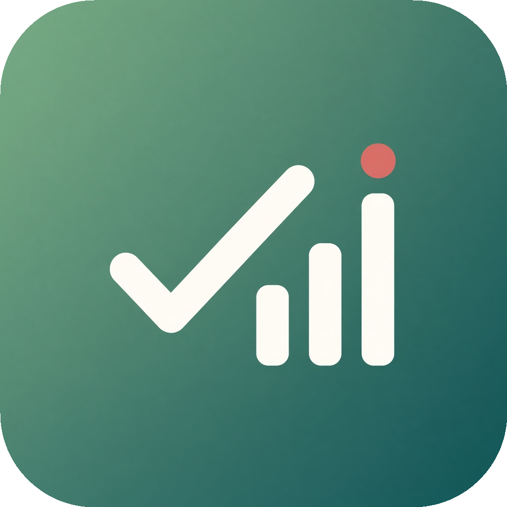

<div align="center">
  
  <h1>Cadence</h1>
  <p><strong>Daily reminders that reset themselves every day.</strong></p>
  <p>A small Windows desktop app for the tasks you repeat — built with Tauri 2, React and SQLite.</p>
</div>

---

## Why

Some tasks come back every single day, and after a while you stop being sure whether you already did today's round. Cadence keeps that list for you: tick a task off and it stays ticked until midnight, when the whole list quietly resets and asks again.

Everything is stored locally in a SQLite file on your PC. No account, no server, no sync.

## Features

- **Daily reset.** "Done" is recorded per calendar day, so every task comes back the next morning by itself.
- **Priorities.** High / Medium / Low, colour-coded down the left edge of each task.
- **Weekday schedules.** A task can appear only on the days you pick — Monday-only chores stay out of the way for the rest of the week.
- **Optional time of day.** Attach a time and Cadence reminds you when it arrives, repeating every 5 minutes until you tick it off.
- **Limited-day routines.** Give a task a day count (say 30). Each completion takes one off, and at zero the task deletes itself and moves to History.
- **Real Windows notifications.** Toast + sound for 3 seconds + a taskbar flash, so a reminder is hard to miss even when the window is hidden.
- **History with undo.** Two tabs — finished routines and tasks you deleted yourself — each with a details view and a restore button.
- **System tray.** Closing the window hides the app in the tray; it keeps reminding you from there.
- **Starts with Windows.** On by default, switchable in Settings.
- **Bilingual.** Full English and Vietnamese interface, including notifications, weekday labels and date formats.
- **Light and dark themes.** A soft sage palette in both.

## Install

1. Download the latest `Cadence_x.y.z_x64-setup.exe` from the [Releases](../../releases) page.
2. Run it. It installs for the current user only, so no administrator prompt.
3. You get a **Cadence** shortcut on the Desktop and in the Start menu.

Windows may show a SmartScreen warning because the installer is not code-signed — choose *More info* → *Run anyway*.

## Using it

| Action | How |
| --- | --- |
| Add a task | **Add task** button, bottom right |
| Mark done | Tick the checkbox; it stays ticked until midnight |
| Undo a tick | Tick it again — a day is added back to limited-day tasks |
| Edit or delete | **Edit** / **Delete** on the task row |
| See everything about a task | **Details** on the task row |
| Bring a task back | **History** tab → **Restore** |
| Language, theme, autostart | Gear icon, top right |

A task with a time shows a banner and sends a notification once that time passes. A task with a day count shows `3/30 days left` under its name.

The window starts at 1420×1024, shrinking automatically if your screen is smaller, and the layout stretches to fill the window when you maximise it.

## How it works

| Piece | Choice |
| --- | --- |
| Shell | [Tauri 2](https://tauri.app) — Rust backend, WebView2 frontend, ~5 MB installer |
| UI | React 19 + TypeScript, one component tree, no UI framework |
| Data | SQLite through `tauri-plugin-sql`, with versioned migrations |
| Notifications | `tauri-plugin-notification` plus a small Rust helper that loops a WAV through `winmm` for 3 seconds |
| Autostart | `tauri-plugin-autostart` (Windows Run registry key) |
| Fonts | Be Vietnam Pro for the UI, Literata for headings |

The "resets at midnight" behaviour needs no timer: a task is a template in the `tasks` table, and ticking it inserts a row into `completions` keyed by `(task_id, YYYY-MM-DD)`. Asking "is this done?" means asking "is there a completion row for today?", so a new day is empty by definition.

Your data lives in `%APPDATA%\com.cadence.desktop\cadence.db`.

## Development

Requirements: Node.js 20+, Rust (stable, MSVC toolchain), Visual Studio 2022 Build Tools with the C++ workload, and the Windows 10/11 SDK.

```powershell
npm install
npm run tauri dev
```

Frontend-only checks:

```powershell
npx tsc --noEmit
npm run build
```

## Building the installer

`rc.exe` from the Windows SDK has to be on `PATH`, so the build runs inside a Developer Command Prompt environment:

```powershell
cmd /c "call `"C:\Program Files (x86)\Microsoft Visual Studio\2022\BuildTools\VC\Auxiliary\Build\vcvars64.bat`" && set `"PATH=C:\Program Files (x86)\Windows Kits\10\bin\10.0.26100.0\x64;%PATH%`" && npm run tauri build"
```

The installer lands in `src-tauri/target/release/bundle/nsis/`.

To regenerate every icon size from the source artwork:

```powershell
npm run tauri -- icon app-icon.png
```

## Project layout

```
src/                 React UI
  App.tsx            Screens and dialogs
  lib/db.ts          All SQLite access
  lib/notify.ts      Notification and alert logic
  lib/i18n.ts        English + Vietnamese strings
  lib/date.ts        Local-day helpers, weekday bitmask
  lib/settings.ts    Theme, language, autostart
src-tauri/src/lib.rs Tray, window behaviour, migrations, alert sound
```

---

# Cadence — Tiếng Việt

**Nhắc việc mỗi ngày, tự reset khi sang ngày mới.**

Có những việc phải làm lại mỗi ngày, và một lúc nào đó bạn không còn chắc hôm nay đã làm hay chưa. Cadence giữ danh sách đó: tick xong thì nó nằm yên tới nửa đêm, sang ngày mới tự bỏ tick và hỏi lại. Dữ liệu nằm trong một file SQLite trên máy bạn, không cần tài khoản, không gửi đi đâu.

### Tính năng

- **Tự reset mỗi ngày** — trạng thái "đã xong" lưu theo từng ngày, không cần hẹn giờ nào.
- **Độ ưu tiên** Cao / Trung bình / Thấp, có màu viền riêng.
- **Ngày trong tuần** — việc chỉ hiện vào những ngày bạn chọn.
- **Giờ cụ thể (tùy chọn)** — đến giờ thì nhắc, nhắc lại mỗi 5 phút cho tới khi tick.
- **Số ngày** — ví dụ 30 ngày; mỗi lần tick trừ 1, về 0 thì việc tự xóa và vào Lịch sử.
- **Thông báo Windows thật** — toast, âm thanh kêu 3 giây, nháy thanh taskbar.
- **Lịch sử + hoàn tác** — hai tab: việc hết ngày và việc bạn tự xóa, đều xem được chi tiết và khôi phục.
- **Khay hệ thống** — đóng cửa sổ là ẩn xuống khay, app vẫn nhắc.
- **Mở cùng Windows**, có công tắc tắt trong Cài đặt.
- **Song ngữ** Việt / Anh, và **hai tông màu** sáng / tối.

### Cài đặt

Tải `Cadence_x.y.z_x64-setup.exe` ở trang [Releases](../../releases) rồi chạy. Bản cài đặt chỉ cài cho người dùng hiện tại nên không cần quyền admin, và sẽ tạo shortcut **Cadence** ngoài Desktop cùng trong Start menu. Windows có thể cảnh báo SmartScreen vì installer chưa có chứng chỉ ký số — chọn *More info* → *Run anyway*.

### Dùng thế nào

Bấm **Thêm việc** ở góc dưới phải để tạo việc; tick ô vuông để đánh dấu đã xong; **Chi tiết** / **Sửa** / **Xóa** nằm ngay trên dòng việc; tab **Lịch sử** để xem lại và **Hoàn tác**; icon bánh răng góc trên phải để đổi ngôn ngữ, tông màu và tùy chọn mở cùng Windows.

Dữ liệu của bạn ở `%APPDATA%\com.cadence.desktop\cadence.db`.
